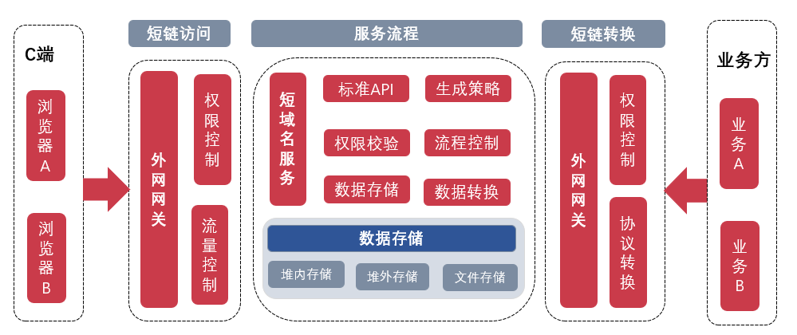
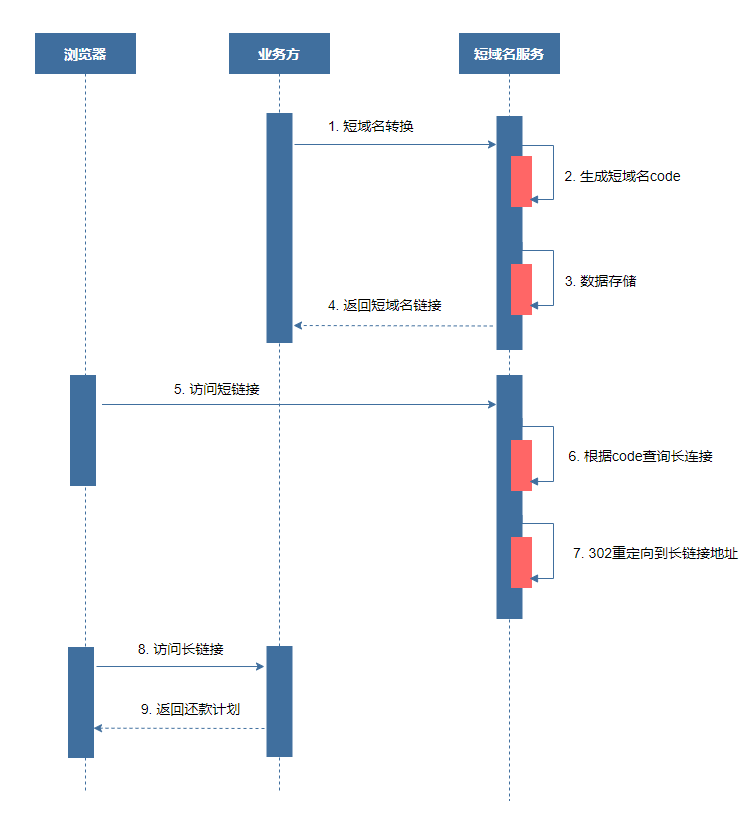
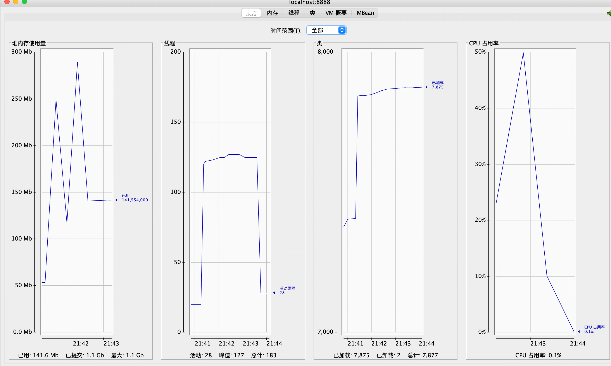
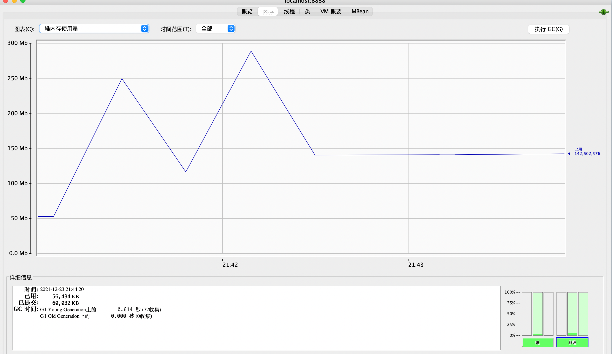
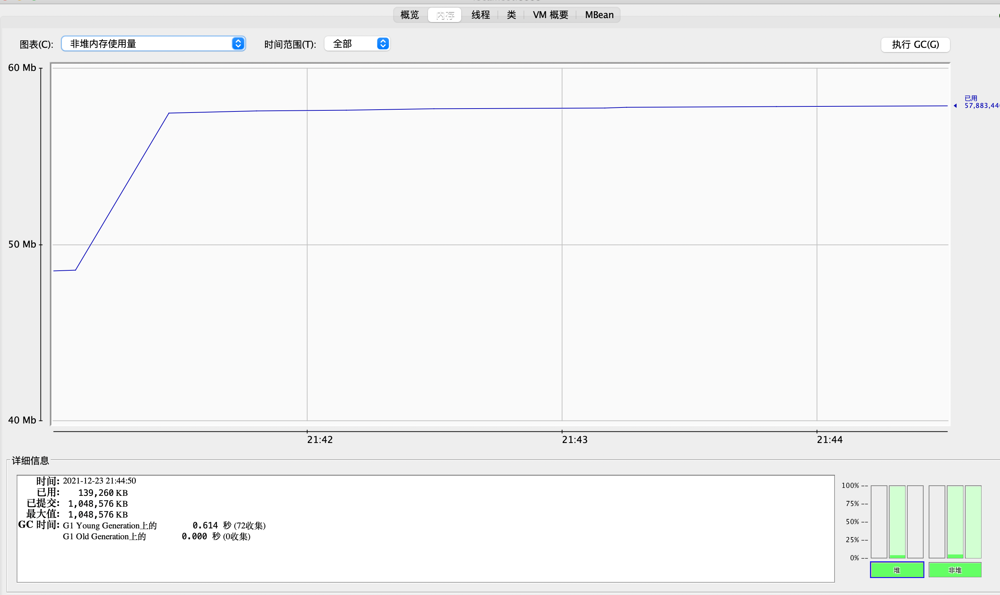
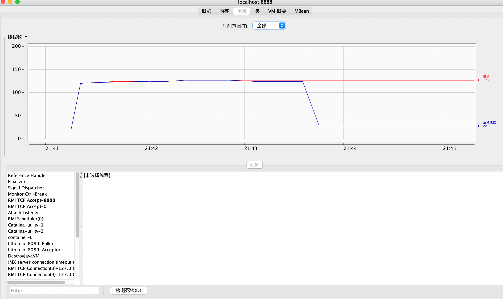
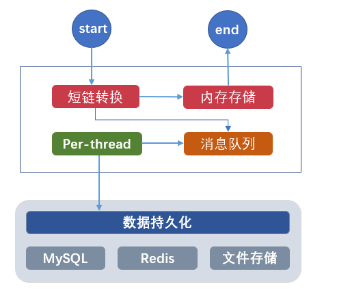

### 一、背景
* * *
日常生活中链接访问是一个非常高频的事件，很多链接由于本身长度原因或者一些敏感参数等问题，不方便在短信、或者有字数限制的文本中投放。针对此类问题需要有一个长连接转短连接的机制，可以方便访问。
所谓短链接，就是将长链接网址缩短到一个很短的网址，用户访问这个短网址时，可以重定向到原来的长链接网址。这样可以达到易于记忆、方便使用、节省资费的目的，常用于有字数限制的微博、二维码等场景

### 二、目标
* * *
搭建短域名生成平台，实现长域名转短域名的方案，访问短域名自动跳转原始长域名。搭建中心化服务，提供统一的API接口，方便其他端接入

### 三、架构设计
* * *
#### 系统架构
系统分层架构，涉及到三端流程，内务业务系统访问服务转换短域名，C端通过短域名访问具体内容

### 四、流程设计
* * *
#### 核心流程

### 五、系统实现
#### 技术方案
1. **短地址生成方案**
   短地址生成主要是在62个字母和数字中按照具体的算法计算出短code和长连接一一映射，目前系统提供两种生成策略，发号器策略以及随机数策略
   **发号器策略：**
   原理：针对每一个请求的长连接，发号器发放一个自增的二进制序号，将序号转成62进制，转换过程每一次余数作为字母表的INDEX下标去获取内容
   优点：不会生成重复的短码，碰撞的可能性为0，可表达的URL可达无穷大
   缺点：生成方式是ID自增的，有迹可循
   **MD5码策略**
   原理：
   a: 针对每一个长连接计算MD5码
   b: 将a得到的8个字符串看成一个16进制的数，与N * 6个1表示的二进制数进行&操作
   c: 将b得到的数分成N段，每段6位，然后将这N个6位数分别与61进行&操作，将得到的数作为INDEX去字母表取相应的字母或数字，拼接就是一个长度为N的短网址
   优点：针对同一个地址生成的短码始终是一样的
   缺点：存在数据碰撞的可能性
2. **数据存储方案**
   本次设计存储方式采用的是进程内存存储，在考虑内存效率和内存溢出的情况下，最终选择使用Ehcache的多级存储方案来实现
   存储模型：
   1、短域名code和长域名地址的映射关系，这里作为后续查询的基础数据
   2、长域名hashcode和短域名code的映射关系，采用hashcode可以节省存储空间
   存储方式：
   1、优先堆内存存储，构建两个cache，分别对应存储模型的两种数据，指定存储的数据个数，防止内存溢出
   2、堆外内存使用，在1的内存数据已满的情况下，根据内部淘汰策略，自动进入二级存储，堆外内存设置指定的大小
   3、文件存储，在2还不满足内存的情况下，使用本地文件存储

#### 服务数据
**单元测试数据：**
单元测试覆盖率整体90%以上

**性能压测数据：**
压测方式采用jemeter压测，设置JVM相关启动参数，通过JConsole工具观测JVM整体数据

JVM启动参数设置：
堆内存初始化内存为1G，堆外内存最大设置为3G，由于没有专门的压测机器，在本机压测暂没有压测系统瓶颈，只是看系统的相关性能

-Xms1G -Xmx1G -Xmn512m -Xss512k -XX:+UseG1GC -XX:MaxGCPauseMillis=200  -XX:MaxDirectMemorySize=3G -Djava.rmi.server.hostname=localhost -Dcom.sun.management.jmxremote -Dcom.sun.management.jmxremote.port=8888 -Dcom.sun.management.jmxremote.rmi.port=8888 -Dcom.sun.management.jmxremote.authenticate=false -Dcom.sun.management.jmxremote.ssl=false

jemter压测情况：
并发线程：100
循环次数：10000
压测接口：长域名转短域名接口、短域名code查询长域名接口

长域名转短域名压测数据如下：
接口RT：95Line 25ms  99Line 59ms  QPS：13513

短code查询长域名压测数据如下：
接口RT：95Line 8ms  99Line 29ms  QPS：17731

JVM内存：
在上述并发请求下，堆内存最高使用接近300M，CPU使用率峰值50%，线程数峰值127，堆外内存使用60M

### 六、未来展望
#### 崩溃恢复
整个服务采用的是基于内存的存储方式，没有持久化数据，在服务重启之后，数据丢失的，可以在现有的方案上考虑持久化方案，持久化可以是本地文件或者外部数据库等中间件
**持久化策略：**
a: 实时持久化：每次转换之后，需缓存和持久化完成才可以返回成功，不会丢失数据，但是效率低
b: 异步持久化：使用一个阻塞队列，每次转换完成之后将数据发送到阻塞队列中，后台异步线程消费数据进行持久化，效率高，但是可能数据丢失

**数据恢复：**
系统重启之后，加载数据进内存中，同时在查询的时候如果内存中没有，可以去持久化组件（数据库）中查询

#### 集群部署
在访问量比较大的时候，需要考虑集群部署，所以服务就需要设计成无状态的，每一个都是可独立部署的单位，集群的情况下就涉及到ID生成器的问题，分布式情况下可以考虑redis或者雪花算法等
方式实现分布式自增ID，如果还是基于单机做也可以考虑自增的方案，比如机器A每次自增是可以整除0的数，机器B是整除1的数这样